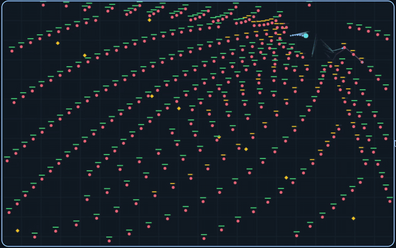

# ECS swarm example



A playable browser ECS example with 512 starting enemies, reinforcements, and
actual projectile entities. The HUD counts live enemies and projectiles.
WASD/arrows move, Space pauses, and R restarts. Keyboard required.

From the repository root:

```sh
examples/arena/build.sh
python3 -m http.server 8000 --directory examples/arena
```

Open <http://localhost:8000>. No npm packages or external assets are needed.
`dist/` is generated and ignored. The build is checked with Bend 2.0.36.

Three weapons fire automatically:

- Bolts target the closest enemy, travel toward it, and deal ¼ maximum health.
  Rate is `10 + enemyCount / 4` shots/second; a fractional accumulator supports
  several real projectile spawns per simulation tick.
- AoE fires every three seconds, damages enemies within 90 pixels for ½ maximum
  health once, and leaves an expanding pulse entity. Its rate does not scale.
- Chain fires every second, dealing ¼ maximum health per impact. It gets
  `3 × ceil(log₂(enemyCount))` bounces after the initial hit: 21 at 100 enemies.
  Each chain carries its own visited-enemy list and never hits an enemy twice.

Enemies have four health units. Bars are green at full health, yellow at
¾/½, and red at ¼. Newborn speed is `1.8 / (1 + 0.35 × ln(1 + enemyCount))`
pixels/tick; existing enemies retain their birth speed. Enemy reinforcements
arrive at 30/second, up to 1,024 live enemies.

`game.bend` owns movement, aiming, damage, cooldowns and the ECS world. A typed
Body family uses indexed columns and a required query with declared write and
despawn capabilities. Spawn commands become visible at a pre-query barrier;
impacts commit transactionally, then dead enemies and expired projectiles are
removed and their component owners cleared at the post-query barrier.
`browser.mjs` supplies input, a fixed 60 Hz clock, and canvas rendering/trails.

This is one compound component family and direct `Compose.each` orchestration.
It does not demonstrate System registration, schedules, resources, events,
relations, complete parity or qualified performance. World creation uses the
existing trusted single-world Factory setup; no handles escape to the host.
The bounded allocator does not recycle IDs: reinforcements stop after 8,191
lifetime enemies, and the demo asks for restart around 100,000 lifetime
projectiles, before its allocation budget can be exhausted. Projectile lifetime is bounded.

Run focused checks (also builds the finite controlled scenarios):

```sh
examples/arena/check.sh
```

These are finite gameplay/host checks, not mathematical proofs. Optional real
browser smoke with an already installed Playwright:

```sh
node examples/arena/browser-smoke.mjs
```

Set `PLAYWRIGHT_MODULE` to its module path if installed elsewhere. Pass a
screenshot filename as the first argument to save a preview. Current evidence
and the Chromium environment limitation are in [CHECKS.md](CHECKS.md).
